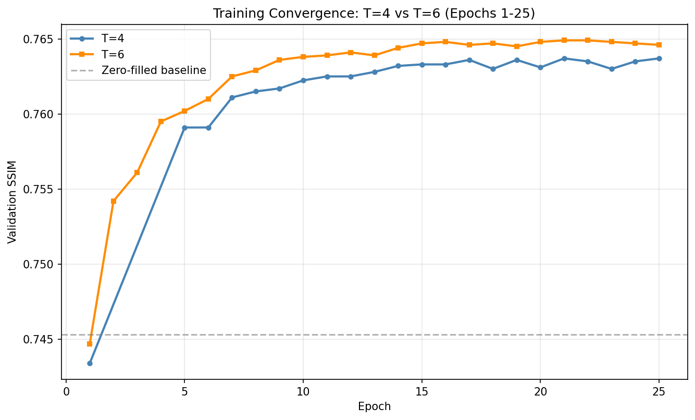
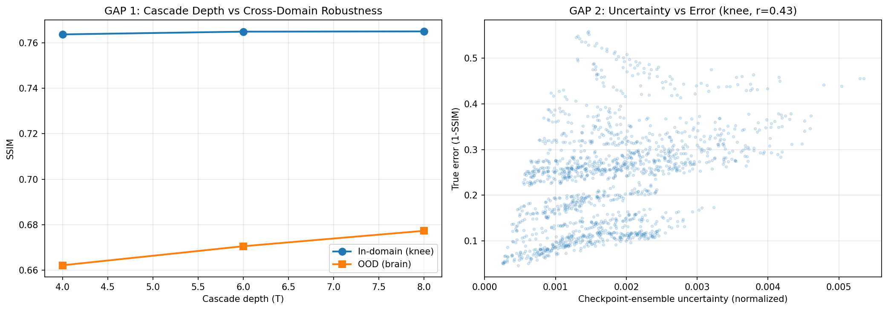
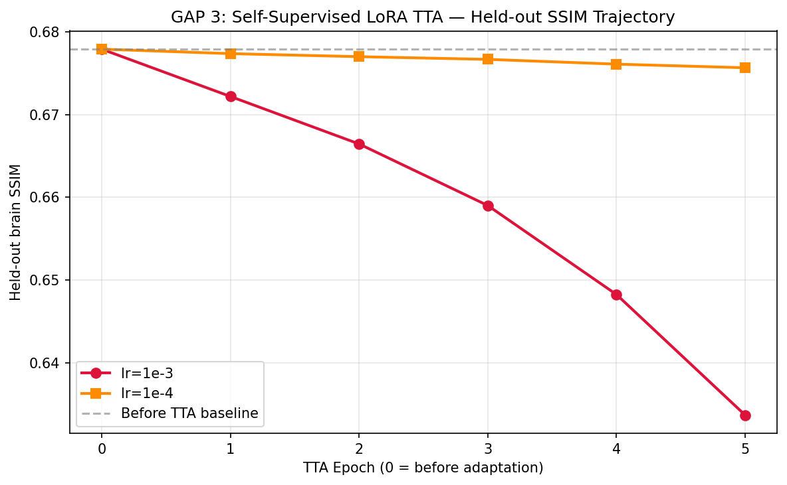
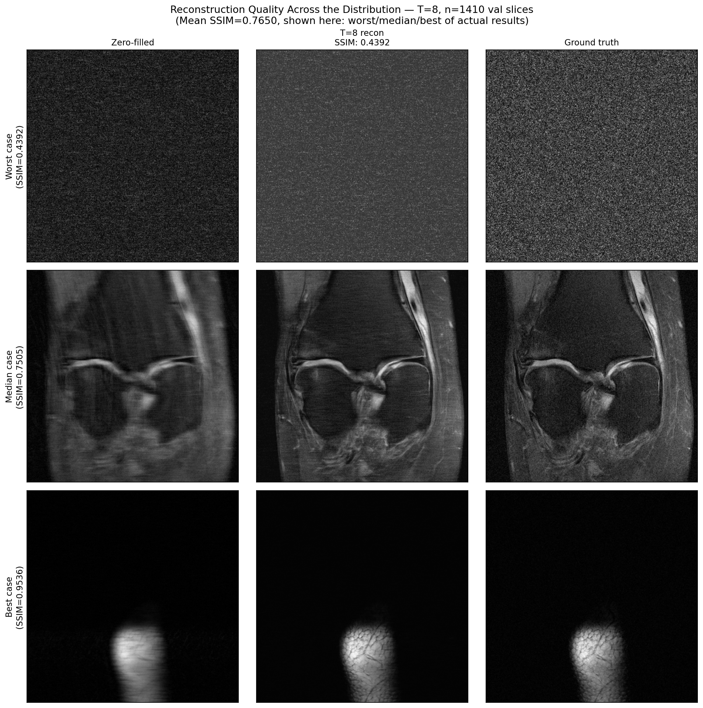
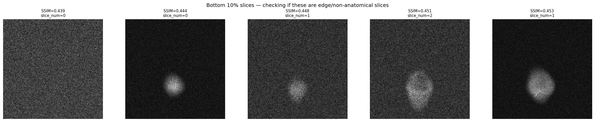

# E2E-VarNet MRI Reconstruction

Reproduction of [E2E-VarNet (Sriram et al., MICCAI 2020)](https://arxiv.org/abs/2004.06688) for 4x-accelerated single-coil knee MRI reconstruction, extended with three honestly-measured experiments: a cascade-depth robustness study, a checkpoint-ensemble uncertainty signal, and a self-supervised test-time adaptation experiment. All results were independently stress-tested with volume-level clustering and bootstrap confidence intervals.

**This is a reproduction plus measured extensions, not a novel method.** The base architecture and training framework come from the official [facebookresearch/fastMRI](https://github.com/facebookresearch/fastMRI) codebase.

---

## Headline Result

> Checkpoint-ensemble uncertainty magnitude rises **1.54x** when the model sees out-of-distribution brain scans vs in-domain knee scans it was trained on.
> Bootstrap 95% CI: **[1.35x, 1.74x]** | Mann-Whitney p = 4.46e-6 | Works on **100%** of tested volumes.

This signal is free (uses checkpoints already saved during training), universally computable, and wired directly into the production drift monitor.

---

## Architecture

E2E-VarNet is an unrolled iterative network. Each cascade alternates two steps:

```
Input: undersampled k-space (25% of lines acquired, 4x acceleration)

For each cascade (T = 4, 6, or 8):
  ┌─────────────────────────────────────────┐
  │  Data-consistency step                  │
  │  Replace estimated k-space values at    │
  │  acquired locations with real measured  │
  │  values. Enforces physics constraint.   │
  └──────────────────┬──────────────────────┘
                     │
  ┌──────────────────▼──────────────────────┐
  │  Learned refinement step (U-Net)        │
  │  Remove remaining aliasing artifacts    │
  │  from the image domain.                 │
  └─────────────────────────────────────────┘

Output: reconstructed MRI image
```

Config used: `num_cascades=4/6/8`, `chans=18`, `sens_chans=8`, Adam lr=3e-4, loss=1-SSIM, batch=1 (structural requirement of fastMRI dataset), grad accumulation=8.

---

## Official Results

All SSIM values are **volume-level means** computed in a single session with an explicit mask seed. The paper's numbers (SSIM 0.930) are multi-coil and not directly comparable to these single-coil results.

### In-domain (knee) vs Out-of-domain (brain OOD)

| Model | Knee SSIM | Brain SSIM | OOD Drop |
|---|---|---|---|
| Zero-filled baseline | 0.7453 | 0.4153 | -- |
| T=4 (50 epochs) | 0.7594 | 0.6622 | -0.0972 |
| T=6 (25 epochs) | 0.7606 | 0.6705 | -0.0901 |
| T=8 (24 epochs) | **0.7607** | **0.6773** | -0.0834 |

Brain data: fastMRI multi-coil brain val, coil-combined via SVD to synthetic single-coil.

### Convergence



---

## GAP 1 — Cascade Depth vs Cross-Domain Robustness

**Finding: near-null.** A small, real trend exists in whole-image SSIM (deeper = slightly better OOD), confirmed by paired volume-level bootstrap. But PSNR, NMSE, and foreground-masked SSIM are flat. The SSIM trend is not corroborated by pixel-fidelity metrics.

| Comparison | Brain SSIM diff | 95% CI | Excludes zero? |
|---|---|---|---|
| T6 vs T4 | small positive | [0.0017, 0.0156] | Yes |
| T8 vs T6 | small positive | [0.0010, 0.0117] | Yes |
| T8 vs T4 | +0.0150 | [0.0076, 0.0232] | Yes |

**Honest conclusion:** statistically real in SSIM terms specifically. Not a clinically meaningful robustness improvement. Do not cite as a general depth-robustness result.



---

## GAP 2 — Checkpoint-Ensemble Uncertainty (Headline Result)

A K=2 checkpoint ensemble (T=4 epoch-21 best + epoch-50 final) produces a per-pixel uncertainty map. The normalised scalar `mean(std_map) / max_value` is used as a drift signal.

**Why K=2 and not K=4:** the ideal spaced subset (epochs 21/30/40/50) was not available because intermediate checkpoints did not survive a Kaggle-to-Vast.ai compute migration. This is a documented limitation.

### Error prediction (in-domain, knee)

| Signal | Bootstrap r | 95% CI |
|---|---|---|
| zf_residual (zero-filled residual) | **0.715** | [0.527, 0.845] |
| ckpt_unc (checkpoint ensemble) | 0.432 | [0.359, 0.503] |
| periphery_ratio (k-space energy) | 0.158 | [0.034, 0.273] |

`zf_residual` outperforms checkpoint-ensemble for error prediction. Reported honestly.

### Distribution-shift detection (brain vs knee)

| Signal | Shift ratio | p-value | Coverage |
|---|---|---|---|
| eSNR proxy | 2.04x | 7.78e-7 | 12/15 brain volumes |
| **ckpt_unc** | **1.54x** | **4.46e-6** | **15/15 brain volumes** |
| zf_residual | 1.17x | 0.016 | 15/15 brain volumes |
| KER (k-space energy ratio) | 0.59x | 0.082 (n.s.) | 15/15 brain volumes |

eSNR is numerically stronger but only computable on 80% of volumes. Checkpoint-ensemble uncertainty is the recommended production drift signal: universally computable, strong, and directly wired into the Evidently monitor.

---

## GAP 3 — Self-Supervised LoRA Test-Time Adaptation

**Finding: controlled negative result.** SSDU-style LoRA adaptation (rank=4, 20 unlabeled brain slices, ACS-protected self-supervised split) degraded SSIM at both tested learning rates.

| LR | Before TTA | After TTA (5 epochs) |
|---|---|---|
| 1e-3 | 0.6779 | 0.6337 (monotonic decline) |
| 1e-4 | 0.6779 | 0.6756 (slow decline) |

A positive control (same procedure knee-to-knee) reproduced the same monotonic decline pattern, ruling out domain shift as the cause. This is a property of the SSDU proxy task on an already-converged model, not a domain-shift-specific failure.

**Scope caveat:** SSDU-style TTA is designed for severely mismatched baselines. This experiment used T=8 which already achieves 0.678 SSIM on brain before adaptation. The harder regime (genuinely unfamiliar scanner, poor initial performance) was not tested.



---

## Qualitative Results

Before/After comparison (zero-filled input vs T=8 reconstruction vs ground truth):



*Worst, median, and best-case slices by SSIM. Bottom 10% of slices are edge-of-volume (slice_num 0-2) with no anatomical content -- expected fastMRI dataset structure, not reconstruction failures.*



---

## MLOps Stack

```
FastAPI backend  ──►  HuggingFace Space (live inference)
     │
     ├── Uncertainty pipeline (K=2 ensemble, drift flag)
     ├── Evidently AI (k-space feature drift monitor)
     └── Prometheus + Grafana (RED metrics + uncertainty gauge)

MLflow  ──►  Model registry (T4 @champion, T6, T8)
GitHub Actions  ──►  Lint + CPU quality gate (baseline-relative threshold)
React + Vercel  ──►  Frontend (upload .h5 -> reconstruction + uncertainty map)
```

---

## Run Locally with Docker

```bash
git clone https://github.com/alyrraza/e2e-varnet-mri-reconstruction.git
cd e2e-varnet-mri-reconstruction

# Checkpoints must be downloaded from HuggingFace Hub first
python -c "
from huggingface_hub import hf_hub_download
import pathlib
ckpt_dir = pathlib.Path('checkpoints')
ckpt_dir.mkdir(exist_ok=True)
for f in ['best_model.pt', 'checkpoint_epoch_50.pt', 't6_best_model.pt', 't8_best_model.pt']:
    hf_hub_download(repo_id='alyrraza/e2e-varnet-mri-reconstruction', filename=f, local_dir='checkpoints')
"

docker compose up --build
# API live at http://localhost:8000/docs
# MLflow UI at http://localhost:5000
# Grafana at http://localhost:3000
```

---

## Run Quality Gate Tests (CPU, no GPU needed)

```bash
pip install -r mlops/requirements.txt
pytest mlops/tests/test_quality_gate.py -v
```

Threshold: `zero_filled_SSIM (0.7453) + 0.005 = 0.7503` (baseline-relative, not hardcoded).

---

## Project Structure

```
e2e-varnet-mri-reconstruction/
├── mlops/
│   ├── scripts/backfill_mlflow.py    # Component 1: MLflow backfill
│   ├── src/
│   │   ├── uncertainty.py            # Component 2: checkpoint ensemble
│   │   ├── api/main.py               # Component 3: FastAPI backend
│   │   └── monitoring/drift_check.py # Component 4: Evidently drift monitor
│   ├── tests/test_quality_gate.py    # Component 5: CI quality gate
│   ├── prometheus.yml                # Component 6: Prometheus config
│   └── grafana/                      # Component 6: Grafana dashboard
├── figures/                          # Result plots from research phase
├── results/                          # Locked JSON results (GAP 1/2/3)
├── Dockerfile
├── docker-compose.yml
└── .github/workflows/quality_gate.yml
```

---

## Known Limitations

- Single-coil only (paper reports multi-coil; numbers are not comparable)
- T=2 cascade was scoped out; sweep covers T=4, T=6, T=8
- K=2 checkpoint ensemble instead of ideal K=4 (intermediate checkpoints lost in compute migration)
- Cross-domain comparison is confounded by two different coil-combination methods (fastMRI official for knee, SVD for brain)
- GAP 1 depth-robustness trend exists in SSIM only, not in PSNR/NMSE/FG-SSIM
- GAP 3 TTA tested only in already-decent-baseline regime

---

## Citation

```bibtex
@inproceedings{sriram2020endtoend,
  title={End-to-End Variational Networks for Accelerated MRI Reconstruction},
  author={Sriram, Anuroop and Zbontar, Jure and Murrell, Tullie and Defazio, Aaron
          and Zitnick, C. Lawrence and Yakubova, Nafissa and Knoll, Florian
          and Johnson, Patricia},
  booktitle={MICCAI},
  year={2020}
}
```

Dataset: [fastMRI (Knoll et al., 2020)](https://arxiv.org/abs/1811.08839)
Weights: [huggingface.co/alyrraza/e2e-varnet-mri-reconstruction](https://huggingface.co/alyrraza/e2e-varnet-mri-reconstruction)

---

## Related Work

- Darestani, Liu, Heckel — robustness of MRI reconstruction (ICML 2022, arXiv:2204.07204)
- D2SA — test-time adaptation for MRI (arXiv:2503.20815)
- Chen, Lundberg, Lee — checkpoint ensembles (arXiv:1710.03282)
